    

- 🌱 Currently learning **Data Structures & Algorithms (DSA)**
- 📝 Regularly solving problems on [LeetCode](https://leetcode.com/krishkhinchi)
- 💬 Ask me about **C++, JavaScript, MERN Stack**
- 📫 Reach me at **krishhackz.in@gmail.com**

 

---

# 🎖️ LeetCode Badges

---

# 🎖️ GSSoC`26 Badges

---

# 🏆 GitHub Trophies

---

# 📈 Contribution Graph

<picture>
  <source media="(prefers-color-scheme: dark)" srcset="https://raw.githubusercontent.com/krishkhinchi/krishkhinchi/output/pacman-contribution-graph-dark.svg">

  <source media="(prefers-color-scheme: light)" srcset="https://raw.githubusercontent.com/krishkhinchi/krishkhinchi/output/pacman-contribution-graph.svg">
  
  
</picture>

 

  

 
 

  

---

## 🛠️ Languages & Tools

 
